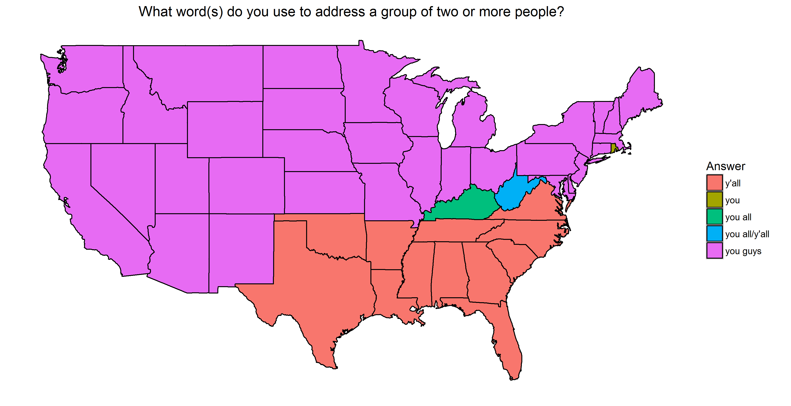

```{r setup, include=FALSE}
knitr::opts_chunk$set(echo = TRUE)
# libraries go here
```

## Introduction

In a superficial way, this assignment is meant to make sure you're familiar with plotting spatial data.  However, the bulk of your time will most likely be devoted to wrangling and reshaping the data so that it's ready to be graphed.  As we move into the final stretch of the class, the hints will now become more sparse.  As with all the previous homeworks, there's no need to look up fancy packages or techniques.  Everything can be done with the tools we already have unless stated otherwise.

## The Data
The data are in the form that they were originally collected (except someone was nice enough to gather all the lat/long coordinates of the zip codes for you).

The data come from a Dialect Survey conducted by Bert Vaux.  Some limited information can be found at the original depracated website [http://www4.uwm.edu/FLL/linguistics/dialect/index.html](http://www4.uwm.edu/FLL/linguistics/dialect/index.html).  Although 122 questions were asked in the survey, the subset of the data provided to you only contains answers to the 67 questions that focused on lexical rather than phonetic differences.

There are three files included in this assignment:

* `question_data.Rdata`, an Rdata file containing
    + `quest.mat` a data frame containing the questions
    + `all.ans`, a list of data frames containing answers to the questions
* `lingData.txt`, a space-separated data table where each observation represents a response to the survey
    + `ID` a unique ID for each participant
    + `CITY` self-reported city of the participant
    + `STATE` self-reported state of the participant
    + `ZIP` self-reported zip code of the participant
    + `lat/long` coordinates calculated from the center of each zip code
    + `Q50-Q121` the participant's response to a question.  Some questions are missing in this range.  A value of 0 indicates no response.  Other numbers directly match their corresponding letter e.g. `1` should match with `a`.
* `lingLocation.txt` an aggregated data set.  The responses from `lingData.txt` were turned into binary responses (e.g. "1 if Participant answered a on question 50 and 0 otherwise").  The data were then binned into 1 degree latitude by 1 degree longitude "squares".  Within each of these bins, the binary response were summed over individuals.
    + `Cell` a unique ID for each lat/long bin
    + `Latitude/Longitude` coordinates for the cell
    + `V4-V471` the number of responses for the corresponding question and answer in the cell.  `V4` corresponds to response `a` to question `50` while `V468` corresponds to answer `g` for question `121` (the very last answer to the last question)
    
Note that while the rows represent the same _data_ in `lingData.txt` and `lingLocation.txt`, they are different _observational units_.  For example, say John and Paul take this questionnaire for two questions. The first question has three answer choices and the second question has four answer choices. If John answered A and D and Paul answered B and D, then `lingData` would encode two vectors: `(1, 4)` and `(2, 4)`. If they lived in the same longitude and latitude box, then it would be encoded in `lingLocation` as one vector: `(1, 1, 0, 0, 0, 0, 2)`.
    
You'll need `read_delim` from the `readr` package to read in the last two files.  Remember to specify the `delim` argument, which demarcates how fields are separated in the text file.

## Task 0
Explore and clean the data.  Document what was added/removed, explaining your actions.
```{r, eval = F}
# Your cleaning code.
library(readr)
library(dplyr)
library(tidyr)
library(ggplot2)
library(rvest)
library(stringr)

lingData <- read_delim("data/lingData.txt", delim = " ")
load("data/question_data.RData")

# State Abbreviations
url <- "http://www.50states.com/abbreviations.htm"
xpath = '//table[@class="spaced stripedRows"]'
abbreviations <- url %>% 
  read_html() %>% 
  html_nodes(xpath = xpath) %>% 
  html_table(fill = TRUE) %>% 
  as.data.frame() %>% 
  select(region = 1, STATE = 2) %>% 
  mutate(region = str_to_lower(region))

# States lat/long data for geom_polygon()
usa <- map_data("state") %>% 
  select(-subregion)

# answers data frame
# convert letter choice to number to join with lingData
answer <- data.frame(do.call('rbind', all.ans)) %>% 
  mutate(ans.let = as.integer(ans.let))

# Gather question columns into one long column "question"
# Join with answers data based on question number and answer choice
lingData <- lingData %>% 
  gather(question, answer, Q050:Q121) %>% 
  select(-ZIP, -CITY, -ID) %>% 
  mutate(qnum = as.numeric(str_extract_all(question, "[0-1]?[0-9]{2}"))) %>% 
  rename(ans.let = answer) %>% 
  inner_join(answer)

# Final cleaned data frame joined with states data
# group by STATE & question to create counts of each answer by state
# join with abbreviations data to remove rows not in the US
# filter to include only the most common answer by state
# filter out rows that are not part of contiguous United States
# join with states data for lat and long coordinates of each state
# join with quest.use to convert qnum to actual survey question
# join with answer data frame to retrieve most common answer choice
lingData_cleaned <- lingData %>% 
  group_by(STATE, qnum) %>% 
  count(ans.let) %>% 
  inner_join(abbreviations) %>% 
  filter(STATE != "HI" & STATE != "AK") %>% 
  filter(n == max(n)) %>% 
  inner_join(usa) %>% 
  ungroup() %>% 
  right_join(quest.use) %>% 
  select(-STATE) %>% 
  inner_join(answer)

# Write to csv file
write_csv(lingData_cleaned, "data/lingData_cleaned.csv")
```
__A paragraph explaining your cleaning process__

First, read and load the questions data and the lingData.txt. Gather the lingData into key-value pairs of question and answer, and extract the number of each question to join with the answers data. Then group the gathered data frame by state and question number and count each answer by state. Filter out rows not in the contiguous United States by web scraping for the 50 state abbreviations and excluding Alaska and Hawaii. Finally, filter to keep only the most common answer in each state and join with usa map_data to determine the latitude and longitude of each state for the graph. Finally, join that data with the question data and the answer data to get the actual survey question asked and the answer choices. 

## Task 1

Implement a Shiny App that colors a map of the continental US based off the most common answer for each state. The user should be allowed to pick one of the 67 questions from a dropdown menu.  If a state has two or more answers that tied, the map should show the tie as a different color.  A static example with a tie in West Virginia is shown below:



As with homework 6, include your server and ui code below along with a link to your app on shinyapps.io.
```{r, eval = F}
# ui code
library(shiny)
load("data/question_data.RData")

shinyUI(fluidPage(
  titlePanel("Dialect Survey Map"),
  
  sidebarLayout(
    sidebarPanel(
      selectInput("question", 
                  label = "Choose the survey question to display:",
                  choices = quest.use[[2]],
                  selected = quest.use[[2]][1])
    ),
    
    mainPanel(
      plotOutput('plot')
    )
  )
  
))
```

```{r, eval = F}
# server code
library(shiny)
library(readr)
library(dplyr)
library(ggplot2)
library(scales)

df <- read_csv("data/lingData_cleaned.csv")

# Wrap labels to new line if past certain len (stack overflow)
wrap.it <- function(x, len) { 
  sapply(x, function(y) paste(strwrap(y, len), 
                              collapse = "\n"), 
         USE.NAMES = FALSE)
}
wrap.labels <- function(x, len) {
  if (is.list(x)) {
    lapply(x, wrap.it, len)
  } else {
    wrap.it(x, len)
  }
}

shinyServer(function(input, output) {
  output$plot <- renderPlot({
    data <- filter(df, quest == input$question)
    ggplot(data) +
      geom_polygon(aes(x = long, y = lat, group = group, fill = ans), 
                   color = "black") +
      theme(
        axis.text = element_blank(),
        axis.line = element_blank(),
        axis.ticks = element_blank(),
        panel.border = element_blank(),
        panel.grid = element_blank(),
        axis.title = element_blank(),
        panel.background = element_blank()
      ) +
      labs(title = wrap.labels(input$question, 80),
           fill = "Answer") +
      scale_fill_discrete(labels = wrap_format(20)) +
      coord_fixed(1.3)
  })
})
```
[Change the url to the link to your app](https://anujkdesai.shinyapps.io/ling_app)

## Task 2

Make visualization(s) of the `lingLocation` data for two questions that you found interesting.  Remember that each row represents a 1x1 square centered at the given lat/long coordinate.

```{r, eval = F}
# plot code goes here
library(ggplot2)
library(readr)
library(stringr)
library(tidyr)
library(dplyr)
library(scales)

lingLocation <- read_delim("data/lingLocation.txt", delim = " ")
usa <- map_data("usa")

answer121 <- all.ans[[121]] %>% 
  mutate(answer = c("V462", "V463", "V464", "V465", "V466", "V467", "V468"))

answer120 <- all.ans[[120]] %>% 
  mutate(answer = c("V456", "V457", "V458", "V459", "V460", "V461"))

lingLocation121 <- lingLocation %>% 
  filter(Longitude > -125) %>% 
  gather(answer, n, V4:V471) %>% 
  filter(answer == "V462" | answer == "V463" | answer == "V464" | answer == "V465"
         | answer == "V466" | answer == "V467" | answer == "V468") %>% 
  inner_join(answer121) %>% 
  distinct(Latitude, Longitude, .keep_all = TRUE)

lingLocation120 <- lingLocation %>% 
  filter(Longitude > -125) %>% 
  gather(answer, n, V4:V471) %>% 
  filter(answer == "V456" | answer == "V457" | answer == "V458" | answer == "V459" |
           answer == "V460" | answer == "V461") %>% 
  inner_join(answer120) %>% 
  distinct(Latitude, Longitude, .keep_all = TRUE)
# Question 121
ggplot() +
  geom_polygon(data = usa, aes(x = long, y = lat, group = group)) +
  geom_point(data = lingLocation121, 
             aes(x = Longitude, y = Latitude, color = ans)) +
  scale_color_discrete(label = wrap_format(20)) +
  coord_fixed(1.3) +
  theme(
    axis.text = element_blank(),
    axis.line = element_blank(),
    axis.ticks = element_blank(),
    panel.border = element_blank(),
    panel.grid = element_blank(),
    axis.title = element_blank(),
    panel.background = element_blank()
  ) +
  labs(title = quest.use[[2]][67])
# Question 120
ggplot() +
  geom_polygon(data = usa, aes(x = long, y = lat, group = group)) +
  geom_point(data = lingLocation120, 
             aes(x = Longitude, y = Latitude, color = ans)) +
  scale_color_discrete(label = wrap_format(20)) +
  coord_fixed(1.3) +
  theme(
    axis.text = element_blank(),
    axis.line = element_blank(),
    axis.ticks = element_blank(),
    panel.border = element_blank(),
    panel.grid = element_blank(),
    axis.title = element_blank(),
    panel.background = element_blank()
  ) +
  labs(title = quest.use[[2]][66])
```
